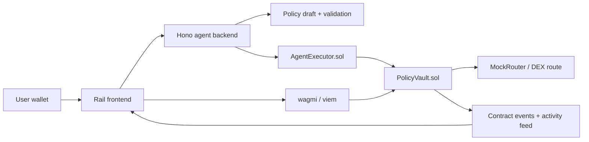

# Rail

Rail is a non-custodial agentic finance app that lets users automate onchain investing while enforcing spending, asset, timing, slippage, reserve, and expiry limits through smart contracts.

The core thesis is simple: the AI agent can propose and submit actions, but `PolicyVault` is the final authority. If an action violates the signed policy, the action is blocked and the user sees why.

## What is built

- React/Vite frontend for connect -> goal -> AI draft -> policy review -> activation -> dashboard.
- Wallet/chain integration with `wagmi`, `viem`, React Query, Robinhood Chain Testnet primary, and Arbitrum Sepolia secondary.
- Hono backend agent service with policy drafting, validation, simulation, execution, activity, and health endpoints.
- Solidity contracts for `PolicyVault`, `AgentExecutor`, `StrategyRegistry`, `MockUSDC`, and `MockRouter`.
- Foundry-shaped tests and deployment script.
- Optional Rust/Stylus proof module for policy risk evaluation.
- Demo operator controls for valid execution, blocked slippage, and blocked overspend.

## Architecture



## Local setup

```bash
npm install
cp .env.example .env.local
```

Do not commit `.env`, `.env.local`, private keys, RPC secrets, or deployer wallets. The repo ignores those files.

## Environment variables

Frontend:

```bash
VITE_RAIL_API_URL=http://localhost:8787
VITE_ROBINHOOD_RPC_URL=
VITE_ARBITRUM_SEPOLIA_RPC_URL=
VITE_POLICY_VAULT_ADDRESS=
VITE_AGENT_EXECUTOR_ADDRESS=
VITE_STRATEGY_REGISTRY_ADDRESS=
VITE_MOCK_USDC_ADDRESS=
VITE_MOCK_WETH_ADDRESS=
VITE_MOCK_ROUTER_ADDRESS=
VITE_ENABLE_DEMO_MODE=true
```

Backend:

```bash
OPENAI_API_KEY=
OPENAI_AGENTS_DISABLE_TRACING=true
ROBINHOOD_RPC_URL=
ARBITRUM_SEPOLIA_RPC_URL=
AGENT_PRIVATE_KEY=
POLICY_VAULT_ADDRESS=
AGENT_EXECUTOR_ADDRESS=
STRATEGY_REGISTRY_ADDRESS=
MOCK_USDC_ADDRESS=
MOCK_WETH_ADDRESS=
MOCK_ROUTER_ADDRESS=
SUPABASE_URL=
SUPABASE_SERVICE_ROLE_KEY=
```

If `OPENAI_API_KEY` is missing, the backend uses a deterministic policy parser so the demo still works. If contract addresses are missing, the frontend uses demo activation and local agent fallback.

## Commands

```bash
npm run dev:frontend      # frontend on Vite
npm run dev:backend       # Hono agent service on http://localhost:8787
npm run build             # frontend typecheck + build
npm run build:backend     # backend typecheck
npm run contracts:build   # compile Solidity contracts with local solc via-IR
npm run contracts:sync    # sync compiled ABIs into src/contracts/generated.ts
npm run verify            # frontend + backend + contract compile
```

Optional commands when external tooling is installed:

```bash
forge test
npm run contracts:deploy:local
npm run stylus:test
npm run stylus:check
```

`forge` and `cargo` were not installed in the current environment during implementation, so Foundry and Stylus tests are included but were not runnable here.

## Backend API

- `GET /api/health` returns backend, OpenAI, RPC, and contract configuration health.
- `POST /api/policies/draft` converts a user goal into a strict policy object.
- `POST /api/policies/validate` validates policy limits.
- `POST /api/agent/simulate` checks whether an agent action should execute or block.
- `POST /api/agent/execute` records an executed or blocked demo action.
- `GET /api/activity/:wallet` returns stored activity for a wallet.

## Demo script

1. Start the backend: `npm run dev:backend`.
2. Start the frontend: `npm run dev:frontend`.
3. Open the Vite URL.
4. Connect a browser wallet or use the demo fallback.
5. Enter a goal like: `DCA 20 USDC into ETH every week. Keep 50 USDC liquid. Stop if slippage is above 1%.`
6. Generate and review the policy.
7. Sign/activate the policy. Without contract env vars this uses demo mode.
8. On the dashboard, run:
   - `Run Valid DCA` to show a permitted action.
   - `Trigger Slippage Block` to show a policy rejection.
   - `Trigger Overspend Block` to show a spend-limit rejection.
9. Open an activity item to inspect the attempted action, rule, simulation result, and transaction/proof status.

## Contract deployment notes

Foundry project settings live in `foundry.toml`. This repo also includes a Node/viem deployment path for environments where Foundry is not installed:

```bash
npm run contracts:deploy:robinhood
```

The deploy script reads `.env.local`, deploys the Rail contracts to Robinhood Chain Testnet, initializes the executor/router/strategy settings, writes public metadata to `deployments/robinhood-testnet.json`, and updates local address fields in `.env.local`.

Optional Foundry path when `forge` is installed:

```bash
forge script contracts/script/DeployLocal.s.sol --broadcast --rpc-url $ROBINHOOD_RPC_URL
```

Current Robinhood Chain Testnet deployment:

- PolicyVault: `0x55738e2957c93fe4cf0da169d6066a672e461b79`
- AgentExecutor: `0xe09e7288adf4d974c230e6daed7d95e8d7737553`
- StrategyRegistry: `0x90a4662141f105e63ce44b1868af26017d6ef2e9`
- MockUSDC: `0x0dfddb41d4b43e10434232d3dc617a8aedb30093`
- MockWETH: `0x147f77bebe41a188614ab73c09de4bff6da6c49f`
- MockRouter: `0x6cb882d547409db1d56c56c2c15312a18fa71ac3`

Explorer: https://explorer.testnet.chain.robinhood.com


## Verification performed

Successfully run in this environment:

- `npm run build`
- `npm run build:backend`
- `npm run contracts:build`
- backend runtime health check
- backend blocked execution smoke request

Not run because required external tools are unavailable:

- `forge test`: `forge` not installed
- `npm run stylus:test`: `cargo` not installed

## Security posture

- Users must approve policy activation.
- Agent actions are checked against policy limits before execution.
- Blocked actions move no funds.
- The backend never receives user private keys.
- Secrets are excluded through `.gitignore` and should remain local only.
